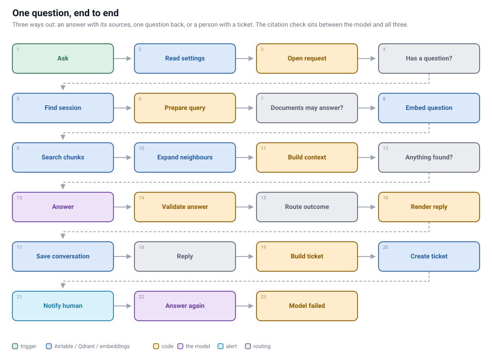
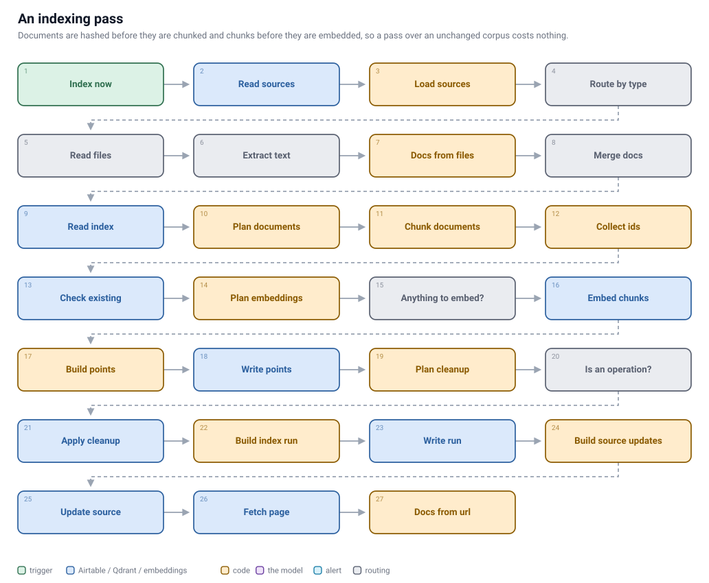

# A support agent that answers from your documents, or says it cannot

Your help centre already answers most of what people write in about. They write in anyway, and
somebody spends their morning copying paragraphs out of a page that has been there for a year.

The obvious fix is a bot on the help centre. The reason people regret that fix is always the same:
one confident, invented answer about refunds, and now every answer needs checking, and the thing is
worse than no bot at all.

So this one is built the other way round. It answers only from your documents, shows the sentence it
took each answer from, and when your documents do not cover the question, it says so and hands the
question to a person.

Here is what that looks like:

```
  Can I get my money back on an annual plan after 20 days?

  Yes. An annual plan can be refunded in full within 30 days of the payment.
  The money goes back to the card that paid, and banks take 5 to 10 business days.

  Sources
    · Refunds → Annual plans   "An annual plan can be refunded in full within 30 days
                                of the payment."
```

and, ten seconds later, from the same person:

```
  Why was I charged 12 dollars on January 3rd?

  I don't know — the documents have nothing on that. I have passed it to a person,
  who will answer here. Reference T-4QBMU.
```

That second answer is the whole point. No document can say why a particular card was charged twelve
dollars, so the agent does not try, and it does not spend a model call finding that out.



## How it decides

Everything happens in one n8n workflow, and the interesting part is the order.

**Before any money is spent.** Questions about a person's own account, money or legal position never
reach the model. That rule is a line in a table, not in the code.

**The search.** The question is embedded and matched against your documents. If nothing comes back
close enough, the model is not called at all — the question goes to a person with "nothing came
close" written on the ticket.

**What the model sees.** Five extracts, and nothing else. No links, so it cannot cite a page it has
not read. Lines inside a document that read like instructions to a model are stripped out first,
because a document is data, not a command.

**What happens to its answer.** The model has to quote a sentence for every claim it makes. Then code
— not the model — checks each quote against the extract it came from, word for word. If a quote is
not there, the answer is thrown away and the question goes to a person. A model that invented a
citation will happily confirm it, so asking it again would prove nothing.

That leaves three ways a question can end: an answer with its sources, one short question back when
the question has two meanings, or a person with a ticket. The reason for each handover is recorded as
a category, and that turns out to be the most useful thing this system produces. A week of "nothing
came close" is a list of pages somebody should write.

## Your rules live in a table, not in the code

Six tables in Airtable: where to read documents from, what the thresholds are, what never reaches the
model, plus a record of every indexing pass, conversation, ticket and evaluation run.

Being picky is a number in a row. While this was being built, the rule about what goes straight to a
person turned out to be too eager twice — once it sent "what happens if my card fails three times?"
to a human, because the question contains the words "my card". Both fixes were a row, not a redeploy.

## Does it actually work

There are 25 questions in `evals/questions.json` with the answers known in advance: ones the
documents answer, ones they do not, ambiguous ones, and one that tries to talk the model out of its
instructions. One command sends them through the same endpoint a person uses and writes the score
next to the size of the index it was measured against.

On the sample corpus — 18 documents, 37 chunks:

- 25 of 25 questions end the way they should, and every citation points at the right document
- a question takes about 3 seconds
- indexing the whole corpus costs about a tenth of a cent; re-indexing when nothing changed costs
  nothing at all, because unchanged documents are never re-read and unchanged paragraphs are never
  re-embedded

The similarity threshold, 0.55, was measured rather than picked. Questions the documents answer scored
between 0.654 and 0.758. Off-topic ones scored between 0.492 and 0.643. Those two ranges nearly touch,
and that is the useful part: "do you offer student discounts?" scored 0.642 against a corpus that says
nothing about student discounts. **No threshold can separate "we have no answer" from "this sounds
like us".** The quote check can, because there is no sentence to quote.

## Running it

You need Docker, Python 3.10 or newer (no packages to install), a Gemini API key and an Airtable
base. Telegram is optional.

```bash
git clone https://github.com/Dimakdev/rag-support-agent && cd rag-support-agent
cp .env.example .env         # fill in the keys
docker compose up -d         # n8n on :5678, Qdrant on :6333
```

Open http://localhost:5678, create the owner account, then **Settings → n8n API** for a key. Put it in
`.env`, and:

```bash
python scripts/seed_airtable.py     # creates the six tables
python scripts/build_workflow.py    # builds the workflow from src/
python scripts/deploy.py            # credentials, vector store, both workflows, activates them
```

The last command prints the address of the chat page and the command that starts an indexing pass.
Run it, then ask the agent something.

```bash
python scripts/run_tests.py    # 24 checks against your own instance, nothing mocked
python scripts/run_evals.py    # the 25 questions
```

This path was walked from a clean clone on a machine with nothing set up, which is how two things
that only worked here got found and fixed. `docs/SETUP.md` has the longer version, including the five
usual ways to get stuck.

## Pointing it at your own documents

Two kinds of source. `markdown` reads a folder mounted into n8n — that is how the sample corpus gets
in. `url` reads one page per row, throws away navigation and footers, and keeps headings as headings
so that the structure survives into the citation.

Add a row to the Sources table, pause the sample one, index. Nothing is rebuilt, nothing is
redeployed.



Both pictures are drawn from `workflow.json` by `scripts/render_graph.py`, so they cannot drift away
from what actually runs. A screenshot of the editor goes stale the moment a node moves.

## What is in here

| | |
| --- | --- |
| `corpus/` | the sample help centre — a made-up company, see its README |
| `src/nodes/*.js` | every code node as its own file, assembled into the workflow by a script |
| `src/page/chat.html` | the chat page n8n serves |
| `schema/airtable.json` | the six tables and the values they start with |
| `evals/questions.json` | the 25 questions |
| `scripts/` | build, deploy, seed, test, evaluate, draw |
| `docs/` | how it is built, why it is built that way, how to set it up |

## What it does not do

`LIMITATIONS.md`, and it is worth reading before you decide this fits. The short version: one corpus
with no per-user permissions, vector search without a keyword index, no reranking, one step of
conversational memory, no OCR, and a chat page that carries its own secret.

The same file lists the three bugs that only appeared when this was run twice in a row rather than
once — including the one where a deleted paragraph stayed answerable, which is exactly the failure
this whole design exists to prevent.

MIT licensed.
